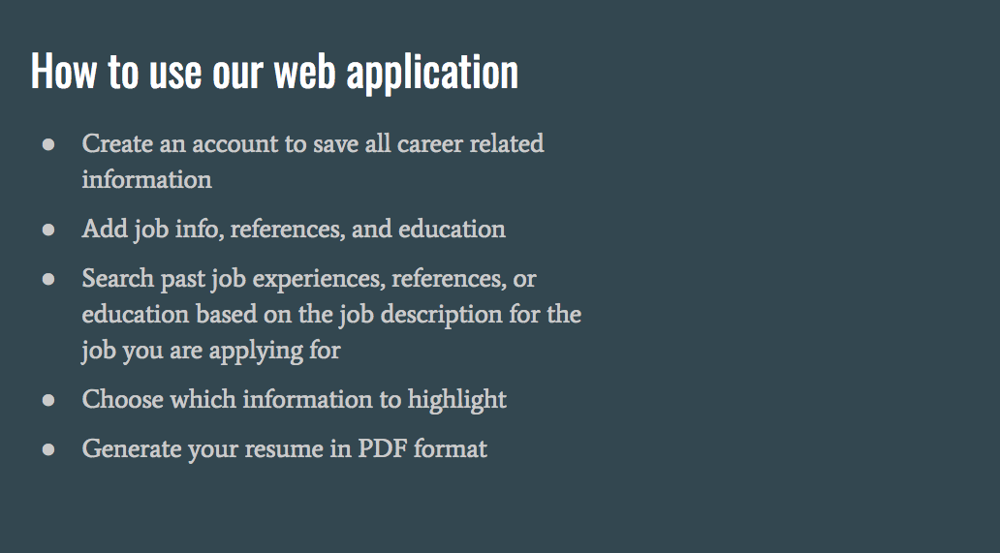

# mySkills Resume Builder
Web application that generates tailored resumes.

## Professional Resume Tailoring Made Easy

mySkills Resume Builder allows users to store all of their job experiences, education, and references in one place so that they can come back to it whenever they need to build a tailored resume. 

This web application allows users to search their job experiences by keywords so that they can then build a tailored resume geared towards the job they are applying for. The user can then select the specific experiences, education, and references that they would like to add to their tailored resume. mySkills Resume Builder streamlines the resume building process for anyone who needs a tailored resume.

## Getting started is easy - simply visit the website, create an account, and start adding your job experiences, education, and references.

Click [here]() to get started.

## Tech Used:
* Web Technologies & Frameworks:
    * HTML5
    * Bootstrap
    * Handlebars
    * less CSS
    * jsPDF
    * passport
    * express

* Scripts:
    * JavaScript
    * jQuery
    * node.js

* Database & ORM:
    * MySQL
    * jawsDB
    * Sequelize

* Deployment Tools:
    * Heroku

* Versioning & Other Tools:
    * GitHub
    * ESLint
    * Travis CI

## Contributors:

[Chris Mera] - UI/UX Design (https://github.com/ChrisMera)

[Jessica Howard] - Database Configuration, Routing (https://github.com/jessicahoward)

[Bernadette Januska] - Account Validation, Database (https://github.com/bmjanuska)

